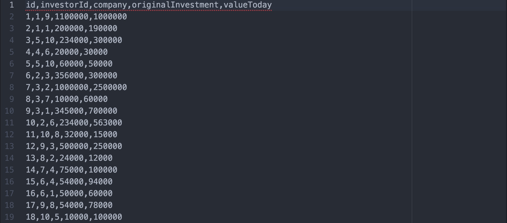
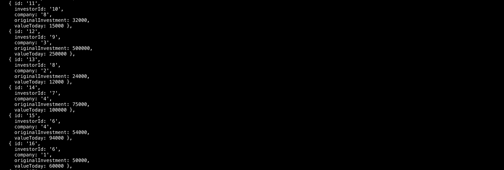
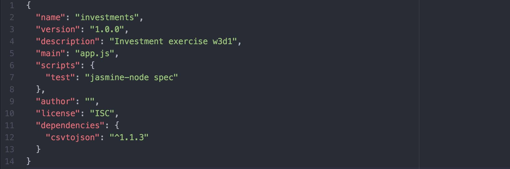
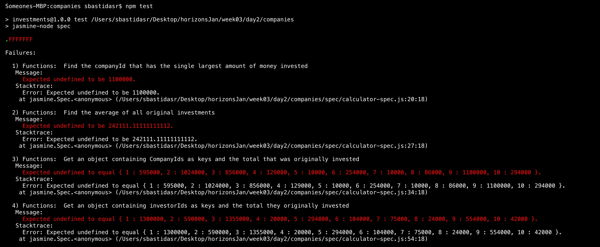

# Pair Programming Exercise: Investment Reports

## Goal

The goal of this exercise is for you to get familiar with node. We will cover the basics about node, files, npm, the package.json file and running your app. You will build an investment report app that takes in two `CSV` files and performs some calculations with the data on the files. CSV stands for "comma-separated values". It is a format to store tables of data such as spreadsheets, by separating each column with a comma.

The first line on a CSV file is usually the header. Ours contains `id, investorId, company, originalInvestment, valueToday`. The header of the file specifies the names of the columns for the table. After the header, a single data entry looks like this: `10, 2, 6, 234000, 563000`. To be able to use it, we will convert them to JSON objects that look like this:

Your app will perform calculations on these JSON objects to find out the best investors, companies with more money and so on.

## Instructions

### Step 1: Setting up the project
1. Open up your console and navigate to the `week3/day2/companies` directory.
1. Install node jasmine by typing `npm install jasmine-node -g` into the console to install the test plugin on your computer. Using `-g` saves the module for all the projects in your computer from now on.
1. Add the `csvjson` module to your project by typing `npm install -s csvjson` in the console. Using the flag `--save` stores the module on your `package.json` file! Check that `csvtojson` was added to the dependencies object.
1. Run `npm install` to install all the required modules to your project.
1. The scripts area of your tests file allows you to specify certain commands that will be normally used in your project. We want to add a `test` script that will run whenever you type `npm test` on your console.

  Currently, running `npm test` prints out 'Error: no test specified'. Add `jasmine-node spec` to your `package.json` file to make it look like this:

  

Run `npm test` again to verify your tests are now running. If you get a similar screen with all the failing/passing tests you are ready to start developing!

### Step 2: Calculating Results

You can now check your tests and see them failing/passing. Open your `functions.js` file and fill in the functions to perform the different calculations. Each function has a short description of the expected results and some hints to achieve them.  

Every time you modify a function or want to check your progress, go to the command line and run `npm test`.

## Results
By the end of this exercise, you should be familiar with the following concepts:
  1. Installing modules to your application using `npm install MODULE_NAME`
  1. Running your tests using `npm test`
  1. Adding scripts to your `package.json` file.
  1. Parsing CSV data and calculating output from it.
